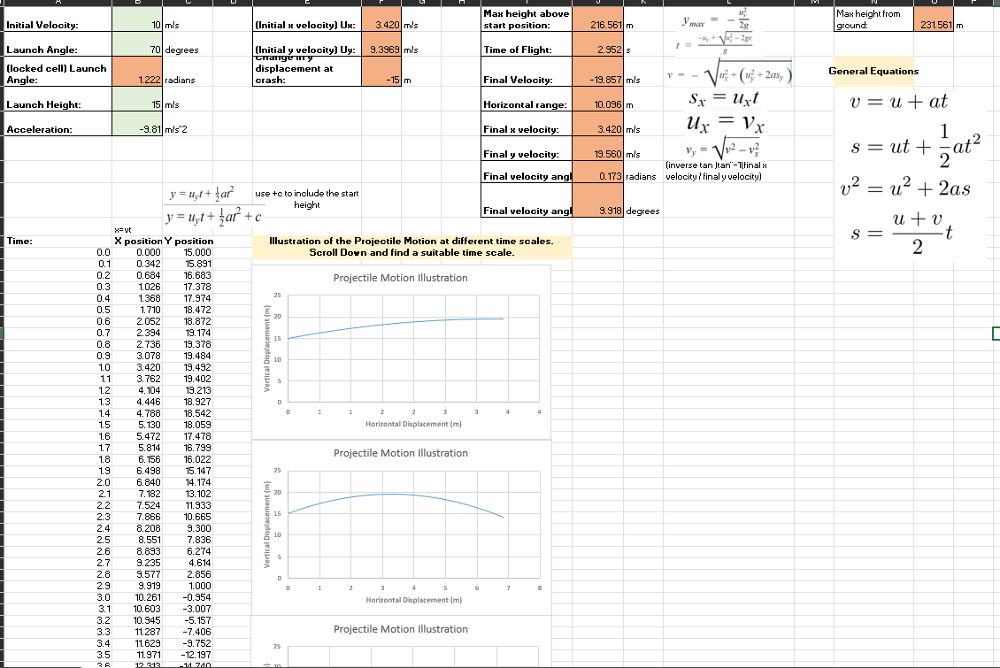

# Excel Helper for Understanding Projectile Motion

> **Note:** In the spreadsheet, **green cells are editable inputs** and **red cells are locked output cells**.  
> The sheet is protected (to prevent accidental edits) with the password **`physics`**.

This project is an Excel-based tool I built during my A-Levels to help visualise **projectile motion** using the standard SUVAT / kinematics equations. By changing the initial conditions, you can immediately see how the trajectory and key values update.

## Features

- Input **initial velocity**, **launch angle**, **launch height**, and **acceleration due to gravity**.
- Automatic calculation of:
  - Time of flight, maximum height, horizontal range, and final velocity components.
- Time-step table showing **x and y positions vs. time**.
- Multiple charts with different time frames plotting **vertical displacement vs. horizontal displacement** to illustrate the projectile path.

## How to Use

1. Open the workbook in Microsoft Excel (or a compatible spreadsheet program).
2. Edit only the **green** input cells to set your scenario.
3. Observe the updated table and graphs to understand how the projectile motion changes.

If you want to modify formulas or structure, you can unprotect the sheet using the password **`physics`**.
